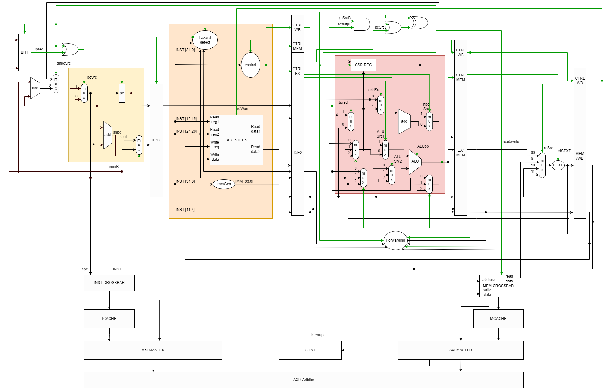
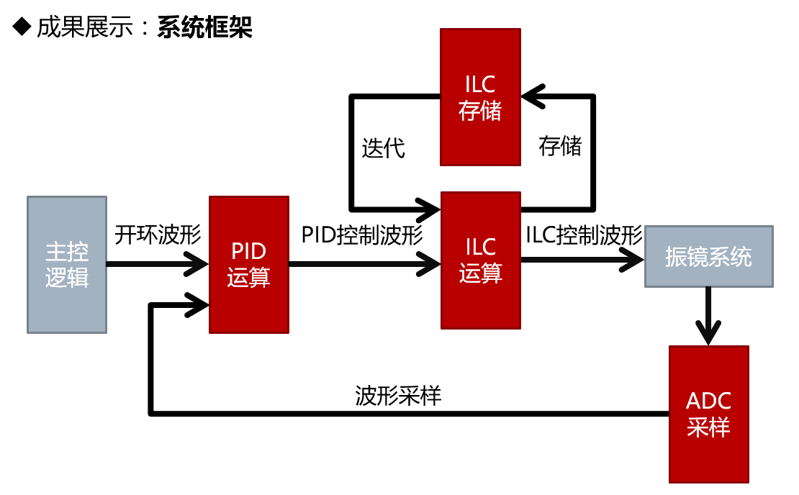
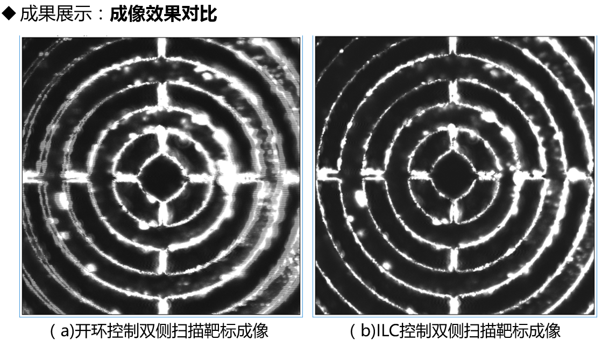
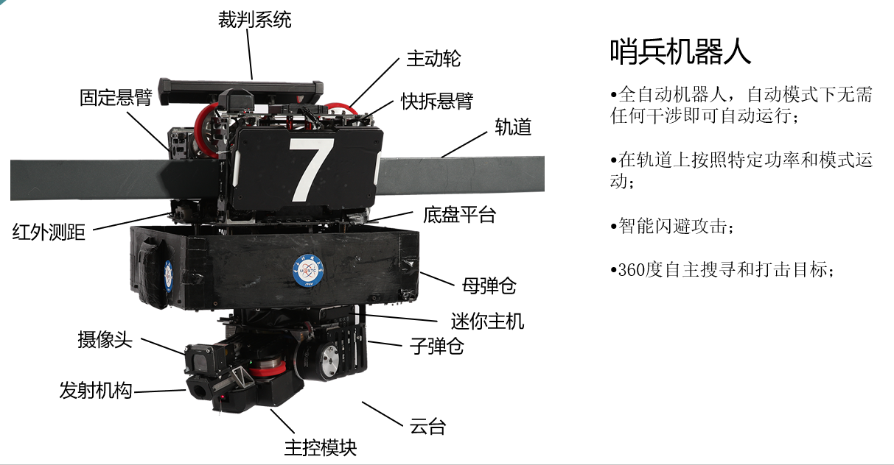
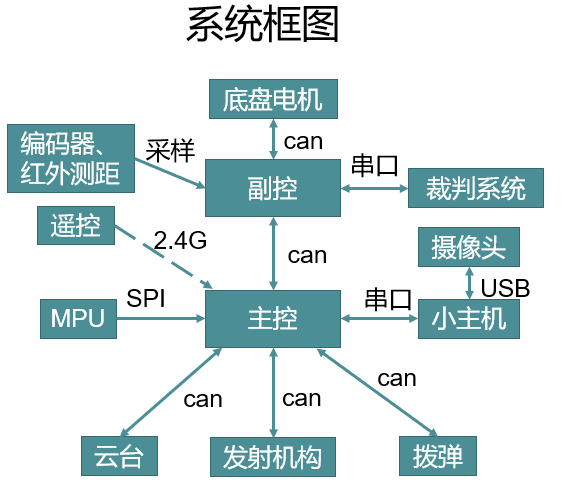
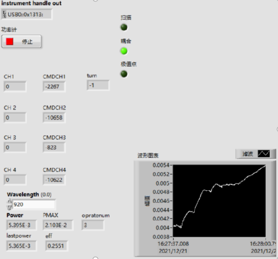
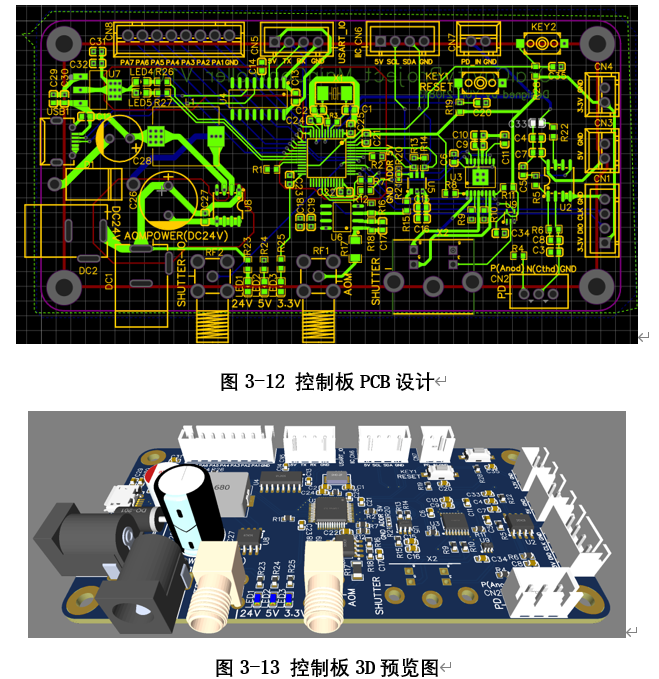
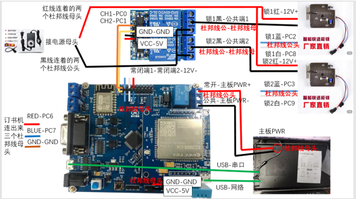

# 项目合集
部分项目合集
___
## 数字IC方向
### [一生一芯第五期](https://gitee.com/mijures/ysyxbackup.git) 2022.9-2023.2 
- 目标：从零开始设计一款能够运行操作系统和应用程序的RISC-V处理器
- 使用c语言基于nemu框架完成了单周期RISC-V仿真器，实现了交互式调试接口、cpu行为记录、基于Linux SDL库的音视频外设仿真，差分测试接口等等功能，成功运行教学操作系统和仙剑奇侠传游戏。
- 使用verilog实现了具有五级流水线、AXI总线、Cache、动态分支预测、内部中断的RISC-V处理器，支持RV64IMZicsr指令，通过Verilator/VCS仿真测试，能够成功运行RT-thread。
- 一生一芯第五期最早获得流片资格的三位同学之一。
- cpu架构图

### [基于存内计算的AI芯片设计与仿真](https://gitee.com/mijures/ai-asic.git) 2021.10-2022.1
- 目标：完成针对NN应用的ASIC芯片设计，实现NN加速
- 使用verilog完成存内运算模块设计，使用c语言实现全连接神经网络的训练、推理、量化、裁剪，完成开源RISC-V芯片与存内运算模块的整合，使用RISC-V GNU Tool Chain 和Iverilog完成NN程序的运行仿真，实现了手写数字识别的100倍加速。
## FPGA方向
___
### 台式双光子显微镜成像矫正（本科毕业设计，北京超维景生物科技有限公司） 2020.10-2022.10  
- 目标：通过优化控制方案实现台式双光子显微镜成像畸变矫正。
- 使用matlab完成台式双光子显微镜的成像仿真平台搭建，完成闭环控制方案设计与仿真测试。主要涉及几何光学仿真、系统辨识、PID控制、ILC控制。
- 使用Quartus完成Altera Cyclone系列芯片的双光子成像迭代学习控制模块的开发与系统整合，实现了良好的成像效果，成果应用在中日友好医院台式双光子显微镜，毕业设计论文成绩优秀。主要涉及ADC驱动开发、SPI通信、RAM读写。
- 使用Vivado完成Xlinx ZYNQ平台的双光子成像闭环控制模块移植工作，成果应用在南京超维景台式多模态双光子显微镜。主要涉及ADC驱动开发、SPI通信、RAM读写、Flash芯片读写、跨时钟域信号处理、时序约束。
- 系统框架

- 成像结果

### 微型化双光子显微镜成像闭环控制与成像矫正（北京超维景生物科技有限公司）  2022.11-今 
- 目标：通过优化控制方案实现微型化双光子显微镜成像畸变矫正。
- 使用matlab完成台式双光子显微镜的成像仿真平台搭建。主要涉及几何光学仿真、离散系统仿真。
### 双侧双光子显微镜成像控制（北京超维景生物科技有限公司） 2022.6-2022.7
- 目标：完成双侧双光子显微镜成像控制程序开发。
- 使用Quartus完成Altera Cyclone系列芯片的双侧双光子显微镜成像控制代码移植与功能开发，实现双侧异步扫描，PZT波形控制。
___
## 嵌入式方向
### 全国大学生机器人大赛Robomaster2019-哨兵负责人、嵌入式软件、项目管理 2018.10-2019.8
- 目标：让哨兵机器人在竞赛战场中全自动运行，自主运动、躲避攻击、识别并打击敌方机器人。
- 完成STM32主控全自动哨兵机器人的嵌入式软件开发，实现机器人的底层运动控制、功率稳定、信息监测、上位机交互等内容。主要涉及电机控制、姿态解算与控制、ADC采样、串口/IIC/SPI/CAN总线通信，板级操作系统使用等。
- 系统展示

### [小型舵机四足机器人](https://gitee.com/mijures/Quadruped-Robot.git)-嵌入式软件       2020.2-2020.4
- 目标：实现四足机器人的对角步态行走、姿态控制、斜面自稳功能。
- 完成matlab平台机器人建模与仿真，主要涉及机器人学建模，运动学正逆解、基于SLIP模型的动力学模型分析，步态设计。
- 完成STM32主控四足机器人嵌入式软件开发，实现机器人的遥控运动功能。主要涉及姿态解算、舵机控制、步态算法实现。
- [运动展示视频](https://www.bilibili.com/video/BV1Z7411m74a)
### 激光自动耦合与光束稳定系统（北京超维景生物科技有限公司）     2021.8-今     
- 目标：完成激光自动耦合与光束稳定系统的算法预研与验证。
- 完成matlab激光耦合光学仿真平台搭建，完成双反射镜式自动耦合与双PSD式光束稳定方案设计与仿真，使用LabVIEW完成自动耦合上位机软件开发，完成自动耦合样机搭建与实验验证工作，输出结论指导产品研发。
- 上位机面板

### 口腔手术机器人：激光耦合模块-嵌入式软硬件      2021.8-2021.10  
- 目标：实现激光耦合模块的激光快门开闭、功率监测和功率控制功能。
- 使用立创EDA完成耦合模块的原理图和PCB设计，主要涉及电源转换、串口通信、电流采样、电机控制、模拟信号输出等电路。
- 完成STM32主控激光耦合模块嵌入式软件开发，使用LabVIEW完成上位机设计，实现以上功能。
- pcb设计

### 云印小站自助打印机-嵌入式软硬件     2022.5-2022.6    
- 目标：完成云印小站嵌入式系统设计，实现联网接受控制信息，控制主机开关、机柜锁、自动订书机等功能。
- 完成主控板、驱动模块等器件选型与样机搭建，完成STM32主控4G开发板的嵌入式软件开发，主要涉及4G芯片的使用、http通信。
- 系统框图

